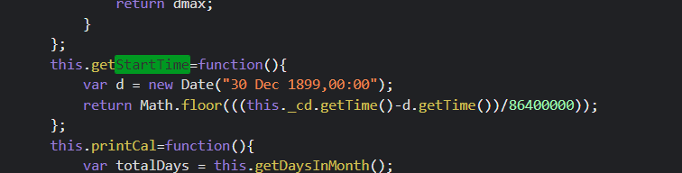

#  Crawling using request package
## Crawling TOI Archive News
To crawl any site using request a deep analysis of the site is required.

### Analysis
Start URL: https://timesofindia.indiatimes.com/archive.cms

The inital crawling url contains a links for each month and in each month there are date for each day.


If we analise the url and the Javascript the we can calculate the url for each day

 and 

by using
``` python 
pre_date = datetime(1899,12,30)
d =  floor((date - pre_date).total_seconds()/86400)
```


### Flow Diagram

